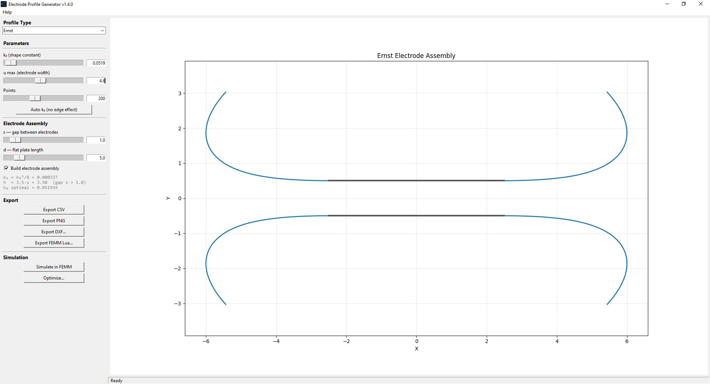
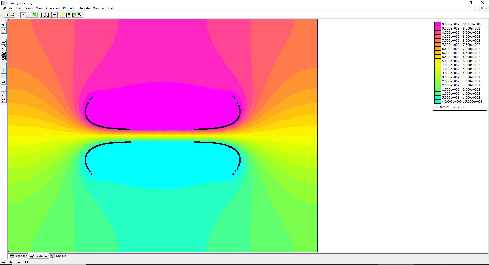
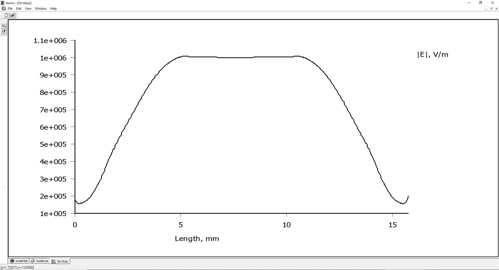

# Electrode Profile Generator

Desktop application for designing parallel plate electrodes with mathematically defined edge profiles. Based on conformal mapping theory, it generates Rogowski, Chang, Ernst, and Bruce profiles — the four classic geometries used in high-voltage engineering to control electric field uniformity between parallel plates.

The tool provides a real-time interactive GUI, full electrode assembly visualization with closing arcs, and direct export to CAD (DXF), simulation (FEMM 4.2 Lua), and data formats (CSV, PNG).

## Screenshots

| Profile editor | FEMM simulation | Electric field plot |
|:-:|:-:|:-:|
|  |  |  |

## Why This Tool?

Parallel plate electrodes need carefully shaped edges to avoid field enhancement at the plate boundaries. The profile geometry is derived from conformal mappings and is not trivial to compute by hand. This tool lets you:

- **Explore** different profile types and parameters interactively
- **Visualize** the complete electrode assembly (top + bottom electrodes with flat plates and closing arcs)
- **Export** directly to SolidWorks/AutoCAD (DXF) or FEMM 4.2 (Lua script)
- **Simulate** electrostatic fields in FEMM without manual model setup (planar and axisymmetric)
- **Optimize** electrode geometry via golden-section, Differential Evolution, or multi-objective NSGA-II
- **Sweep** parameter ranges to map ΔE % landscapes

## Features

| Feature | Description |
|---------|-------------|
| **4 profile types** | Rogowski, Chang, Ernst, Bruce — selectable from a dropdown |
| **Live preview** | Sliders + text entry update the plot in real time |
| **Electrode assembly** | Full mirrored construction with closing arcs (tangent to profile) |
| **Planar & axisymmetric** | Support for both 2D planar and axisymmetric electrode geometries |
| **Ernst Auto k₀** | One-click calculation of optimal k₀ for edge-free design |
| **DXF export wizard** | R12–R2018, Spline or Polyline, layer control |
| **FEMM Lua wizard** | Complete simulation setup: voltages, εᵣ, mesh, boundary conditions |
| **FEMM live simulation** | Run FEMM directly from the GUI (requires pyfemm) |
| **Profile optimizer** | Three algorithms: Golden-section (1-D), Differential Evolution (global), NSGA-II (multi-objective Pareto) |
| **Parameter sweep** | Evaluate ΔE % across a parameter range (single or multi-parameter) |
| **Input validation** | All numerical inputs validated with clear error messages; accepts both `.` and `,` as decimal separator (European format) |
| **Built-in user manual** | Chapter-based help accessible from the Help menu |

## Quick Start

```bash
git clone https://github.com/PauBasCalopa/ElectrodeGenerator.git
cd ElectrodeGenerator
pip install -r requirements.txt
cd src
python main.py
```

CLI mode: `python main.py --cli` · Build exe: `build.bat` → `dist\ProfileGenerator.exe`

## Project Structure

```
src/
├── main.py                  — Entry point (GUI default, --cli for CLI)
├── version.py               — App metadata
├── core/                    — Pure logic (no UI)
│   ├── profiles.py          — Rogowski, Chang, Ernst, Bruce generators
│   ├── assembly.py          — Electrode assembly builder (profiles + plates + arcs)
│   ├── contour.py           — Measuring contour utilities
│   ├── optimizer.py         — Optimizer (golden-section, DE, NSGA-II) & sweep
│   └── validation.py        — Input validation
├── exporters/               — File output
│   ├── csv_exporter.py      — CSV export
│   ├── png_exporter.py      — PNG export
│   ├── dxf_exporter.py      — DXF export (R12–R2018)
│   └── femm_exporter.py     — FEMM Lua script generator
├── simulation/              — FEMM integration
│   ├── femm_model.py        — Shared model builder (pluggable backends)
│   └── femm_simulator.py    — Live FEMM COM driver
└── gui/                     — Tkinter GUI
    ├── app.py               — Main application window
    └── dialogs/             — DXF, FEMM, optimizer, and help dialogs
```

## Profile Equations

Based on: *Espino-Cortes, F. et al. (2000). "Numerical study of the profile of parallel plate electrodes." Proceedings of the Universities Power Engineering Conference.*

### Rogowski

Derived from a conformal mapping of the half-plane:

$$X = \frac{s}{\pi} \left(u + 1 + e^u \cos v\right)$$

$$Y = \frac{s}{\pi} \left(v + e^u \sin v\right)$$

where $v = \pi/2$ (constant) and $s$ is the electrode gap. As $u \to -\infty$, $Y \to s/2$ — the natural gap between two mirrored Rogowski curves is exactly $s$.

### Chang

Single-parameter conformal mapping with compactness control:

$$X = u + \cos(v) \cdot \sinh(u)$$

$$Y = v + k \cdot \sin(v) \cdot \cosh(u)$$

where $v = \pi/2$ (constant), $u \in [0, u_{\max}]$, and $k > 0$ controls the profile compactness.

### Ernst

Two-term extension of Chang with automatic harmonic coefficient:

$$X = u + k_0 \cos(v) \sinh(u) + k_1 \cos(2v) \sinh(2u)$$

$$Y = v + k_0 \sin(v) \cosh(u) + k_1 \sin(2v) \cosh(2u)$$

where $v = \pi/2$, $k_1 = k_0^2 / 8$, and $u \in [0, u_{\max}]$.

**Optimal k₀ (edge-effect free):**

$$k_0 = 1.72 \cdot e^{-3.5s}$$

Valid for $s < 3$. Edge effects become significant at $s \approx 3$.

### Bruce

Piecewise profile with sinusoidal transition and circular termination:

**Sinusoidal section:**

$$Y = -R_e \sin\!\left(\frac{x}{x_0} \cdot \frac{\pi}{2}\right)$$

**Circular end:** quarter-circle of radius $R_e$.

**Constraint equations:**

$$x_0 = \frac{A}{\cos(\alpha_0)}, \qquad R_e = \frac{2}{\pi} \cdot x_0 \cdot \tan(\alpha_0)$$

where $A \approx s$ (gap distance) and $\alpha_0$ is the characteristic angle.

## Dependencies

- **numpy** · **matplotlib** · **ezdxf** — core dependencies
- **pyfemm** — optional, for live FEMM simulation
- **pyinstaller** — optional, for building the standalone exe

## License

MIT
